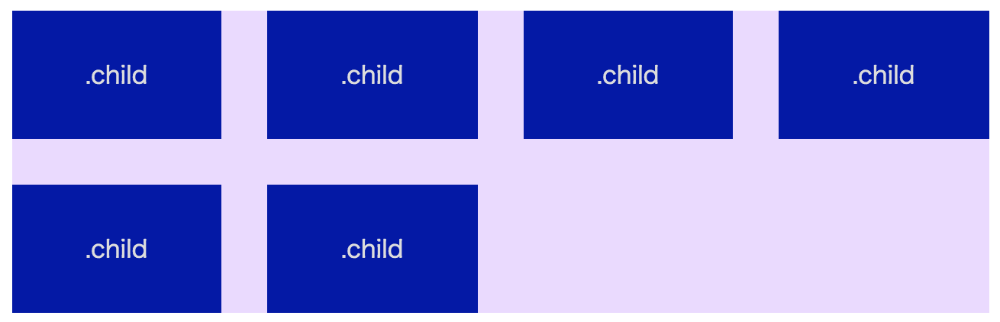

# scss-mixin-gutter-column

レスポンシブ対応。カラム数とカラム間marginを自由に設定するMixin。<br>
scss-mixin-gutter-column is mixin of columns that margin width can be freely adjusted.

# 使い方/Usage

包括要素内で```col()```mixinをインクルードし、カラム数やカラム要素のclass名などを指定します。<br>
include ```col()``` mixin in container element and set some arguments.

```
/*
@include col(
	number of column, // *required
	gutter margin, // *required
	class name,
	display type(flex/float/grid),
	is list(true/false)
) {
	other styles
}
*/

@include col(
	カラム数,	// *必須 (例) 3
	カラム間margin幅,	// *必須 (例) 30px
	カラムのセレクタ,	// (例) '.child'
	CSSのタイプ(flex/float/grid),	// (例) flex
	リストか否か(true/false)	// (例) false
) {
	その他のスタイル
}
```

カラム数

## 使い方例/Sample

- 包括要素 : ```.container```
- カラム数 : 4
- カラム間margin幅 : 30px
- カラムのセレクタ : ```.child```
- CSSのタイプ : flexbox
- リストか否か : false

### HTML

```
<div class="container">
	<div class="child">.child</div>
	<div class="child">.child</div>
	<div class="child">.child</div>
	<div class="child">.child</div>
	<div class="child">.child</div>
	<div class="child">.child</div>
</div><!-- /.container -->
```

### SCSS

```
.container {
	@include col(4, 30px, '.child', flex, false);
}
```



※上下marginはmixinには含まれませんので、必要に応じて個別で設定してください。
